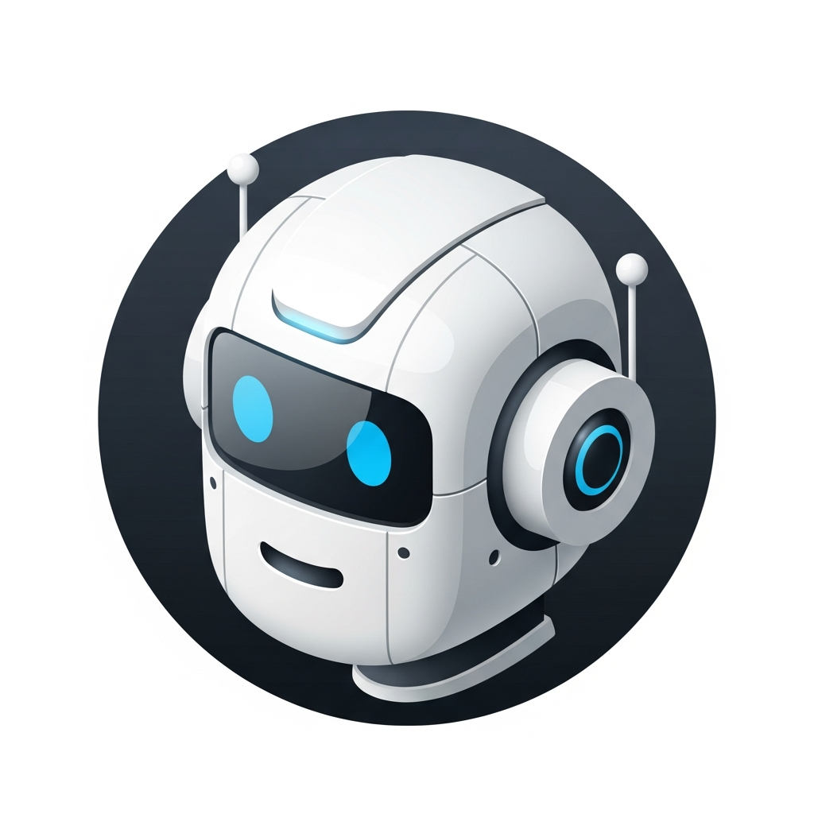

# Anthroid

<p align="center">
  
</p>

Anthroid is a native Android app for **mobile agentic workflows**: a Claude Code-style agent that can work with your phone’s native capabilities (camera, voice, clipboard, notifications, app/URL launching, location/calendar, screenshots, and optional UI automation).

## When it helps

- **On-call / incident triage away from your desk**: run quick diagnostics in a terminal, keep a chat thread with context, and resume the conversation later.
- **Field work & device setup**: scan QR codes to avoid retyping tokens/URLs, open links on-device, and copy/paste between apps.
- **Hands-busy workflows**: dictate messages with **offline** speech recognition so you can keep moving even with poor network.
- **“What am I looking at?” troubleshooting**: attach photos/screenshots for visual context, then follow a short step-by-step checklist.
- **Phone-use automation**: copy key info to clipboard, open deep links, launch apps, set reminders via notifications, and combine device context (location/calendar) with instructions.

## Overview

Anthroid (Android + Anthropic) is a mobile implementation of [Claude Code](https://docs.anthropic.com/claude-code), designed around mobile-native input methods and device capabilities.

**Design goals**
- **Device tools**: access to location, calendar, clipboard, notifications, URL/app launching, and more.
- **Mobile input**: voice dictation (offline `sherpa-onnx`) and camera capture/QR scanning.
- **Agent-style automation**: optional overlay shows what the agent is doing when it operates outside the app.
- **Terminal at hand**: a full bash environment for advanced workflows.

## Features

### Chat Interface
- Native Android chat UI with streaming responses
- **Markdown rendering** - Tables, bold, italic, code blocks, links
- **Conversation history** - Resume past conversations
- Light blue user bubbles, gray assistant bubbles

### Voice Input
- **Offline speech recognition** using sherpa-onnx
- Supports Chinese, English, Japanese, Korean, Cantonese
- Press-and-hold microphone button to speak
- Real-time transcription display

### Camera & Vision
- Take photos to add visual context to messages
- Gallery picker for existing images
- Multiple images per message
- **QR code scanning** with instant text insertion and clipboard copy

### AI Agent Tools
Claude can execute tools on your device:

| Tool | Description |
|------|-------------|
| Bash | Run terminal commands |
| Read/Write/Edit | File operations |
| Glob/Grep | Search files and content |
| Notification | Show Android notifications |
| Clipboard | Read/write clipboard |
| Open URL | Launch browser |
| Launch App | Open installed apps |
| Location | Get GPS coordinates |
| Calendar | Query calendar events |
| Screenshot | Capture device screen |
| Screen Tap/Swipe | UI automation |

### Screen Automation Overlay
When Claude launches other apps or performs actions outside Anthroid:
- **Floating banner** appears at the top of screen showing agent status
- **Streaming text** displays what Claude is currently doing
- **Stop button** to cancel the operation at any time
- **Auto-hides** after task completion (tap to return to Anthroid)
- Requires overlay permission (Draw over other apps)

### Terminal Environment
Built-in Linux terminal for advanced users:
- Full bash shell environment
- Package manager (apt/pkg)
- Node.js, Python, and more available

## Installation

### Download APK
Get the latest release from [GitHub Releases](https://github.com/k-l-lambda/anthroid/releases).

### Build from Source

```bash
# Clone repository
git clone https://github.com/k-l-lambda/anthroid.git
cd anthroid

# Build debug APK
./gradlew assembleDebug

# Install on device
adb install app/build/outputs/apk/debug/anthroid-app_apt-android-7-debug_arm64-v8a.apk
```

### Requirements
- Android 7.0+ (API 24)
- ARM64 device recommended
- ~200MB storage (+ optional 239MB for voice model)

## Setup

### API Configuration
1. Get your Claude API key from [Anthropic Console](https://console.anthropic.com/)
2. In Anthroid, go to **Settings** > **API Configuration**
3. Enter your API key and base URL

Or use QR code for quick setup:
1. Generate QR code with API credentials
2. Open Camera > QR scan mode
3. Scan the QR code

### Voice Input Setup
1. Go to **Settings** > **Components**
2. Download ASR Model (239MB, one-time)
3. Wait for model initialization
4. Microphone button appears in chat

## Architecture

```
┌─────────────────────────────────────────────────┐
│                 Anthroid App                    │
├─────────────────────────────────────────────────┤
│   Chat UI          │   Terminal UI              │
│   - Messages       │   - Full Linux shell       │
│   - Voice input    │   - Package manager        │
│   - Camera/QR      │   - Claude CLI             │
├─────────────────────────────────────────────────┤
│   Claude Integration                            │
│   - Streaming API responses                     │
│   - Tool execution (Bash, Files, Android APIs)  │
│   - Conversation management                     │
├─────────────────────────────────────────────────┤
│   Native Components                             │
│   - sherpa-onnx (offline ASR)                   │
│   - ML Kit (QR scanning)                        │
│   - CameraX (photo capture)                     │
└─────────────────────────────────────────────────┘
```

### Key Technologies
- **Kotlin** - Primary language
- **CameraX** - Camera capture
- **ML Kit** - QR code scanning
- **sherpa-onnx** - Offline speech recognition
- **Markwon** - Markdown rendering

## License

GPLv3 - Same license as Termux. See [LICENSE.md](LICENSE.md).

## Credits

- [Termux](https://github.com/termux/termux-app) - Terminal emulator foundation
- [Anthropic](https://anthropic.com) - Claude AI
- [sherpa-onnx](https://github.com/k2-fsa/sherpa-onnx) - Speech recognition
- [Markwon](https://github.com/noties/Markwon) - Markdown rendering
